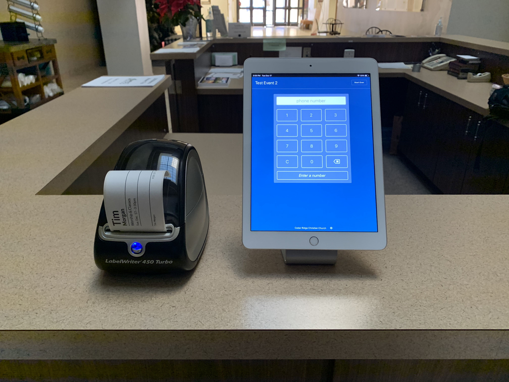

# Raspberry Pi as a Check-Ins Printer Station

This document outlines the steps I use to set up a Raspberry Pi as a Check-in Printer Station. That is, a "computer" that connects to a Dymo printer and accepts print jobs from [Planning Center Check-Ins](https://planning.center/check-ins/download) running on a tablet, phone, or another computer.

This repo also includes a script that modifies the Pi and installs software.



## Why?

Dymo printers are cheap, but I haven't found a way to connect them directly to an iPad. Since our church uses iPads for check-in, we like to print labels from them without a bulky, expensive PC/Mac sitting in the middle of it.

The Raspberry Pi is an inexpensive alternative to a full computer, but it does take a bit more work to get it all set up correctly.

## How it Works

We install the Planning Center Check-Ins app on the Raspberry Pi and set it to start automatically when the Pi boots up. We also install other necessary software and connect the printer with [Cups](https://www.cups.org/).

Once everything is set up, all your Check-Ins stations can see the Pi as another station and print to it, even though it has no display or keyboard.


Of course, you can hide the Raspberry Pi away under a table or whatever.

## What You'll Need

1. A [Planning Center Check-Ins](https://www.planningcenter.com/check-ins) subscription

1. An iPad or other tablet to run Check-Ins app

1. A Raspberry Pi 4 with at least 2 GB of RAM.

   This will *not* work on an older Raspberry Pi.

1. A Dymo printer

   I have only tested with the Dymo LabelWriter 450 and 450 Turbo.

   Other Dymo printers *should* work out of the box, but I haven't tested any others.

   Further: A printer made by another brand (not Dymo) could probably be made to work with this setup, assuming there is a Linux print driver for it. There is not any Dymo-specific software used, but the setup script only knows how to install Dymo printers. You would need to set up the printer manually or tweak the script.

## The General Process

I put together a video showing generally how everything is installed. Be sure to follow the detailed instructions below when doing these steps yourself.

<a href="https://youtu.be/sH3Qwt0vvbc"></a>

## The Steps

1.  On a desktop computer, download the Raspberry Pi Imager tool [here](https://www.raspberrypi.com/software/). 

1.  Run the imager. Click "Choose OS" and select "Raspberry Pi OS 32 Bit". 

1.  Click "Choose Storage" and select your SD card (insert it now if you haven't already). 

1.  Click the gear icon for Advanced Options. Click the checkbox for "Enable SSH". Leave the option for "Use Password Authentication" selected. Scroll to the next section and enter a new password for the default user pi. Don't change the name of the user or parts of the setup script will fail. 

1.  Check the option for "Configure Wireless LAN" assuming you're not plugging into a wired ethernet.  If you'd like, you can also change other advanced options such as the default host name from raspberrypi to something more specific (like "checkinprinter"). You'll use this name to access the Raspberry Pi in later steps, but also in the future if you need to update or fix anything on the pi. 

1. Now click "Write" - writing the image may take a few minutes. When done, move the SD card to the Raspberry Pi and power it on.

1.  SSH to the Pi using the new password you set above. Be sure to substitute the hostname if you changed from the default.

    ```sh
    ssh pi@raspberrypi.local
    ```
    Enter the new password you picked in Advanced Options

1.  Enable VNC using raspi-confi

    ```sh 
    sudo raspi-config
    ```

    Use the arrow keys to select Interfacing Options and press Enter. 

    Use the arrow keys to select VNC and press Enter. 

    You will be prompted to enable VNC Server.

1.  Download and run the setup script.

    Note: You should still be connected to the Pi. This command will run remotely on the Pi itself.

    ```sh
    curl https://raw.githubusercontent.com/seven1m/rpi-check-in-printer/latest/setup.sh -o setup.sh
    chmod +x setup.sh
    ./setup.sh
    ```

1.  Assuming you made it through the setup process and you were able to print a test label, you can continue to the next step.

    **DO NOT CONTINUE until you can get a test label to print using the setup script above.**

1.  Use VNC from your desktop to connect to the Pi.

    Download and run [RealVNC](https://www.realvnc.com).

    Connect to "raspberrypi.local" (substitute the host name if you changed that)

    The VNC password is the one you set earlier.

1.  Set up the Planning Center Check-Ins Software.

    You should see Planning Center Check-Ins asking you to set up a new station.

    Go through the process to create a new station. Give it a name, and accept the defaults for everything else.

    *For the station name, I use something like "Welcome Center RPi" so I know where it is and what type of station it is.*

1.  You should see this dialog window:

    

    Be sure to select "Remember this decision" and click the "Allow" button.

1.  Point your iPad or other station to the Raspberry Pi:

    Visit the [stations page](https://check-ins.planningcenteronline.com/stations) in Check-Ins and click to open the settings for your iPad station.

    In the "Print Station" drop-down, choose your Raspberry Pi station you just created.

1.  Do a test check-in!

## Troubleshooting

**DO NOT CONTACT PLANNING CENTER SUPPORT ABOUT ISSUES WITH THIS SETUP. THEY WILL NOT BE ABLE TO HELP YOU.**

**Problem: Printing doesn't work!**

Here are some troubleshooting steps, starting closest to the hardware:

1.  Make sure the setup script was able to print a test label. If not, you may need to figure out why the command `echo "test" | lpr -P "Dymo" -` isn't working.

1.  Check that the Dymo printer is setup via Cups at [https://IPADDRESS:631](https://IPADDRESS:631). Print a test page from this UI.

1.  Use VNC to connect to the Pi and visit the Print Setup page in the Check-Ins app. You can get there by pressing Ctrl-2.

**Problem: Labels print slow and/or cut-off**

Sometimes, labels will print **extremely** slow and pause mid-way through printing a label.

I have found that _some_ Dymo printers do not work well with my `dymo_lag_fix.rb` script. It's not an issue with a particular model, but rather seems to be a random problem. My solution is to swap printers around (often times even the same exact model number) and everything starts working as expected!
